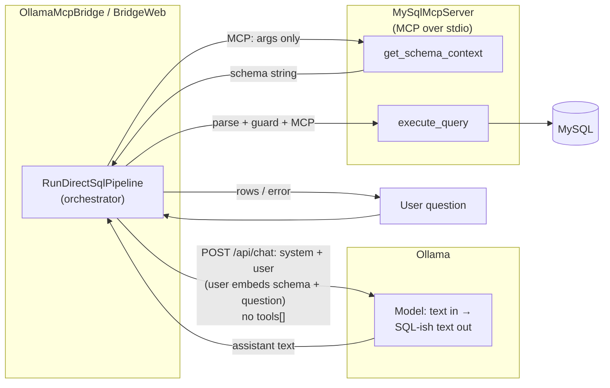

# Db_Agent — MySQL (MCP) + Ollama SQL bridge

**What runs where (see architecture below):** a local model **writes** a `SELECT` as plain text. Your app **never** sends MCP tool definitions to Ollama, **never** lets the model call the database, and **always** runs SQL through the MySQL sidecar after sanitization. No cloud LLMs in the default path.

## Architecture (high level)



| Layer | Role |
| ----- | ---- |
| **Ollama** | **Generates** the SQL string from the prompt (schema + your question in the user message). It does **not** execute SQL and does **not** receive an MCP / `tools` list for this app. |
| **OllamaMcpBridge** | Loads schema via MCP, builds chat messages, calls Ollama, **sanitizes** and **read-only-checks** the reply, then calls **`execute_query`** on the MCP process. **Two things never go to the model:** how tools are named, and raw query results (unless you add that yourself). |
| **MySqlMcpServer** | Project name = **this process is an MCP stdio server** that exposes MySQL as MCP tools. Used **two ways:** (1) the bridge as **orchestrator** (schema + run SQL), (2) other clients (e.g. Claude Desktop) with full MCP tool use. The name is correct; the confusion was implying the **LLM** was an MCP tool client, which it is not in this pipeline. |
| **MySQL** | Storage; reached only through `MySqlMcpServer` in this design (connection string on the child process). |

**Your mental model (aligned with code):** attach **database context** (schema text) **into the chat** as part of the user message → **one** Ollama response → **your code** turns that into SQL, validates it, and **executes** it via MCP/`execute_query`. The **LLM is still used** for the **wording** of the SQL, not for tool picking or for running queries.

## What you need installed

- **[.NET 8 SDK](https://dotnet.microsoft.com/download/dotnet/8.0)** — check with `dotnet --version`
- **[Ollama](https://ollama.com/download)** — after install, it usually runs in the background (Windows: system tray)
- **MySQL** with a read-only user — easiest for first try: use the [Docker test database](#local-test-database-docker-mysql-8) in this repo (optional: [Docker Desktop](https://www.docker.com/products/docker-desktop/))

**Default model in this repo:** `Ollama:Model` is **`qwen2.5-coder:7b`** in `OllamaMcpBridge/appsettings.json` and `BridgeWeb/appsettings.json`. You **must download that model once** (or change the config to another model you have):

```bash
ollama pull qwen2.5-coder:7b
```

Check it exists:

```bash
ollama list
```

You should see `qwen2.5-coder:7b` in the list. If Ollama is not running, start it (open the Ollama app, or in a terminal run `ollama serve`).

## Quick start (do this in order)

You only run **one** .NET app for Q&A: **`OllamaMcpBridge`** (console) or **`BridgeWeb`** (browser). You **do not** need to `dotnet run` `MySqlMcpServer` by hand — the app **starts it for you** in the background.

1. **Start Ollama** and **pull the default model** (first time only), then confirm it is listed:
   ```bash
   ollama pull qwen2.5-coder:7b
   ollama list
   ```
   API defaults to `http://localhost:11434`. (See also [**What you need installed**](#what-you-need-installed) for context.)
2. **Start MySQL** and know your DB name + user + password. For the included Docker test DB, follow [Local test database](#local-test-database-docker-mysql-8) through `docker compose up -d`, then set (replace the password with yours from `mysql.env`):

   ```powershell
   $env:ConnectionStrings__MySQL = "Server=localhost;Port=3306;Database=db_agent_test;User Id=agent_user;Password=YOUR_PASSWORD;SslMode=None;"
   ```

   Use your own MySQL instead: change `Server` / `Database` / `User Id` / `Password` in that string. Set this in **the same terminal** you use for the next step.

3. **Go to the repo root** (folder that contains `Db_Agent.sln`):

   ```powershell
   cd path\to\Db_Agent
   ```

4. **Start the app** — pick one:

   **A — Web UI (easiest to try)** — leave this terminal open:

   ```powershell
   dotnet run --project BridgeWeb
   ```

   When it says it is listening, open a browser: **http://localhost:5088** → type a question in English → click **Run**. The answer appears on the page (and row data as JSON in the “Result” section when it succeeds).

   **B — Console (no browser)** — one-shot question, output in the terminal:

   ```powershell
   dotnet run --project OllamaMcpBridge -- "How many rows are in the employees table?"
   ```

5. **If something fails:** Ollama not contacted → check `ollama list` and that nothing blocks port **11434**. DB errors → recheck `ConnectionStrings__MySQL` and that MySQL is up. **Port 8080** in this project is the optional **Adminer** website from Docker; the web app is **5088**, not 8080.

**Optional:** to use a different Ollama model, edit `Ollama:Model` in `appsettings.json` or set `Ollama__Model` in the environment, and run `ollama pull` for that name. For **large schema / slow local GPUs**, increase **`Ollama:RequestTimeoutSeconds`** (default **600** in config) or set **`Ollama__RequestTimeoutSeconds`** — the default `HttpClient` timeout of 100s is too short and will return HTTP 500 with `TaskCanceledException` if Ollama is still generating.

## Local test database (Docker MySQL 8)

Synthetic data only (`example.test` emails, generated names). **`.env` here is only for this optional Docker stack** (root + `agent_user` bootstrap). **Production** uses your existing MySQL and **only** the app connection (e.g. **`ConnectionStrings__MySQL`** with a read-only user)—**no MySQL root password** in application secrets.

**Docker DB credentials** live in **`mysql.env`** (gitignored), not in git.

1. Start Docker Desktop.
2. From the repo root:

   ```powershell
   Copy-Item mysql.env.example mysql.env
   # Edit mysql.env: MYSQL_ROOT_PASSWORD, AGENT_USER_PASSWORD, MYSQL_DATABASE
   ```

   Use **`mysql.env`** (not **`.env`**) for these variables so Docker Compose does not treat **`$`** inside passwords as variable references. You can keep a separate **`.env`** for other tools if you want.

3. First-time bring-up (creates volume, runs `docker/mysql/init/*.sql` and `99-create-agent-user.sh` once):

   ```powershell
   docker compose up -d
   ```

4. **`agent_user` is `SELECT`-only** on `db_agent_test.*` (matches the MCP server’s read-only tools).

5. **Browse tables in the browser (Adminer):** with the stack up, open [http://localhost:8080](http://localhost:8080). Log in with:
   - **System:** MySQL
   - **Server:** `mysql` (Docker service name; already the default)
   - **Username:** `root` (full access) or `agent_user` (read-only)
   - **Password:** from `mysql.env` (`MYSQL_ROOT_PASSWORD` or `AGENT_USER_PASSWORD`)
   - **Database:** `db_agent_test`

6. Connection string for MCP / bridge (PowerShell; use your real `AGENT_USER_PASSWORD` from `mysql.env`):

   ```powershell
   $env:ConnectionStrings__MySQL = "Server=localhost;Port=3306;Database=db_agent_test;User Id=agent_user;Password=YOUR_AGENT_PASSWORD;SslMode=None;"
   ```

7. **Re-run init scripts** only by recreating the data volume (destroys data):

   ```powershell
   docker compose down -v
   docker compose up -d
   ```

8. **End-to-end check** (Ollama running, model pulled, Docker MySQL healthy):

   ```powershell
   cd C:\Users\vscsi\Desktop\siri\Db_Agent
   $env:ConnectionStrings__MySQL = "Server=localhost;Port=3306;Database=db_agent_test;User Id=agent_user;Password=YOUR_AGENT_PASSWORD;SslMode=None;"
   dotnet run --project OllamaMcpBridge -- "How many rows are in the employees table?"
   ```

**Schema (larger test DB):** `departments` (50), `employees` (200), `projects` (100), `assignments` (400), `customers` (150), `products` (200), `orders` (300), `order_line_items` (900), `skills` (25), `employee_skills` (300). Init order: schema → seed → `agent_user` + `GRANT SELECT`. After **any** init SQL change, recreate the data volume: `docker compose down -v` then `docker compose up -d` so MySQL re-runs init.

**Test SQL reasoning (tight questions, not “bigger is harder”):** see **`examples/reasoning-test.sql`** — **two** prompts (department/skill average; order-line revenue by product category) with **reference SQL** you can run in Adminer and compare to the model.

If `99-create-agent-user.sh` fails on Windows, ensure the file uses **LF** line endings (see `.gitattributes`).

## Secrets (do not commit passwords)

**Application (all environments):** set the DB user the MCP server uses—typically a **single** connection string (least privilege, `SELECT` only in production), not MySQL `root`.

Set the connection string via environment (recommended for sensitive data):

- **`ConnectionStrings__MySQL`** — full MySQL connection string (double underscore is intentional for nested config).

Example (PowerShell, current session only):

```powershell
$env:ConnectionStrings__MySQL = "Server=localhost;Port=3306;Database=db_agent_test;User Id=agent_user;Password=***;SslMode=None;"
```

`appsettings.json` may leave `ConnectionStrings:MySQL` empty; environment variables override JSON when both are present.

## Run the MCP server (stdio)

From the repo root:

```powershell
dotnet run --project MySqlMcpServer
```

Logs are written daily under `MySqlMcpServer/logs/` (next to the built output, see `Logging:LogDirectory` in `appsettings.json`): files like `mcp-server-YYYYMMDD.log`.

### MCP tools exposed (MySqlMcpServer)

These are the **MCP** entry points (e.g. for Claude or manual `tools/call`). The **Ollama bridge** only drives **`get_schema_context`** and **`execute_query`** from code; it does not expose MCP tools to the model.

| Name                 | Purpose                                        |
| -------------------- | ---------------------------------------------- |
| `get_schema_context` | Full schema text (bridge calls this first)     |
| `list_tables`        | Comma-separated table names                    |
| `describe_table`     | Columns for one table (`table_name`)           |
| `execute_query`      | Read-only `SELECT` / `WITH` only, max 200 rows |
| `refresh_schema`     | Reload cache after DDL changes                 |

## Run the Ollama bridge (CLI) / API

`BridgeRunner.RunDirectSqlPipeline` in **`OllamaMcpBridge/BridgeRunner.cs`** implements the [architecture above](#architecture-high-level). **`BridgeWeb`** calls the same runner from `POST /api/ask`.

From the repo root (so `MySqlMcpServer/MySqlMcpServer.csproj` can be found), with `ConnectionStrings__MySQL` set for the shell (the child MCP process inherits it):

```powershell
cd C:\Users\vscsi\Desktop\siri\Db_Agent
$env:ConnectionStrings__MySQL = "Server=localhost;Port=3306;Database=db_agent_test;User Id=agent_user;Password=***;SslMode=None;"
dotnet run --project OllamaMcpBridge -- "How many tables are in the database?"
```

Configure Ollama in `OllamaMcpBridge/appsettings.json` or `BridgeWeb/appsettings.json` (or `Ollama__*` env vars): **`Ollama:BaseUrl`**, **`Ollama:Model`**, **`Ollama:Temperature`**, **`Ollama:RequestTimeoutSeconds`** (default **600** — Ollama HTTP client timeout; raise if generations exceed it).

## Raw MCP over stdio (single `tools/call` example)

MCP uses newline-delimited JSON-RPC. After your client completes the `initialize` handshake, you can call a tool (one JSON object per line written to the server’s stdin). Example body:

```json
{
  "jsonrpc": "2.0",
  "id": 2,
  "method": "tools/call",
  "params": { "name": "list_tables", "arguments": {} }
}
```

You must send `initialize` / `notifications/initialized` per the MCP spec before `tools/call` will succeed; use an MCP-aware client for full sessions.

## Claude Desktop (optional)

Add to `%APPDATA%\Claude\claude_desktop_config.json` under `mcpServers`:

```json
"mysql-local": {
  "command": "dotnet",
  "args": ["run", "--project", "C:/Users/vscsi/Desktop/siri/Db_Agent/MySqlMcpServer"],
  "env": {
    "ConnectionStrings__MySQL": "Server=localhost;Port=3306;Database=db_agent_test;User Id=agent_user;Password=REPLACE_ME;SslMode=None;"
  }
}
```

Use a full path to `MySqlMcpServer.csproj` on your machine; **do not** commit real credentials—set `env` locally or use OS-level secrets.

## Security notes

- `execute_query` allows only statements that start with `SELECT` or `WITH` (after leading comments), rejects multiple statements, and caps rows at **200**.
- Connection strings are never returned from tools.
- All tool invocations and SQL are logged to the daily log files for audit.
